# SentinelAPI 3-Minute Live Hackathon Demo Script & Resilience Guide

> **Total Presentation Duration**: 3 Minutes (180 Seconds)  
> **Speaker Role**: Founder / Lead Security Architect  
> **Target Audience**: Technical Hackathon Judges, Security Engineers, Product Teams  
> **Live Demo URL**: [http://localhost:8080](http://localhost:8080)

---

## Timed Demo Script (180 Seconds)

```mermaid
gantt
    title 3-Minute SentinelAPI Live Demonstration Timeline
    dateFormat X
    axisFormat %s s
    section Pitch & Scan
    01. The API Authorization Blindspot (30s)    :0, 30
    02. Multi-Persona Live Audit Execution (60s) :30, 90
    section Deep Dive
    03. Differential Inspector & cURL PoC (45s)   :90, 135
    04. Zero-Trust Verification (SECURE=true) (30s) :135, 165
    section CI & AI
    05. CI Security Gate & AI Analyst (15s)      :165, 180
```



---

### [0:00 - 0:30] Phase 1: The Problem Statement (30 Seconds)
- **Visual**: Terminal showing `scripts/demo.sh` or browser at [http://localhost:8080/scans/new](http://localhost:8080/scans/new).
- **Spoken Script**:
  > *"Every engineering team today ships APIs at breakneck speed. But here's the dirty secret of modern security: traditional DAST scanners test for injection flaws like SQLi or XSS. They have zero understanding of business logic or authorization.  
  > That's why **Broken Object Level Authorization (BOLA/IDOR)** remains the #1 vulnerability on the OWASP API Security Top 10. A user changes `id=101` to `id=102` in an API call and accesses another customer's private data, credit cards, or medical records.  
  > Today, we built **SentinelAPI**: an autonomous, differential API security engine that maps attack surfaces from OpenAPI specs, logs in multiple real user personas, learns object ownership ground-truth, and detects authorization bypasses with empirical reproduction."*

---

### [0:30 - 1:30] Phase 2: Live Audit Execution & Telemetry Stepper (60 Seconds)
- **Visual Action**:
  1. On [http://localhost:8080/scans/new](http://localhost:8080/scans/new), highlight the **"Load Sample Target Environment"** radio button panel.
  2. Click the radio button for **🛒 ShopSentinel Retail Store (:9000)** (or **🏥 MedPulse Healthcare :9001**).
  3. Point out how the Base Target URL, OpenAPI Schema, and 3 personas (`userA`, `userB`, `admin`) auto-populate instantly.
  4. Ensure the authorization consent checkbox is checked.
  5. Click **"Launch Security Audit"**.
- **Visual Transition**: The browser immediately navigates to `/scans/:id/live`.
- **Spoken Script**:
  > *"Watch our live 5-stage orchestration pipeline execute in real-time on our live telemetry stepper:  
  > 1. **Surface Mapping**: It parses and dereferences the OpenAPI spec with strict circular-reference protection.  
  > 2. **Authentication**: It authenticates our distinct test personas against the target API.  
  > 3. **Discovery**: Without brute-forcing or guessing IDs, it queries legitimate endpoints to discover what objects each user genuinely owns.  
  > 4. **Matrix Compilation**: It builds a mathematical ground-truth authorization matrix: who should be allowed, and who must be denied.  
  > 5. **Differential Attack**: It launches budgeted, rate-limited cross-user probes and compares responses mathematically using weighted Jaccard similarity."*

---

### [1:30 - 2:15] Phase 3: Differential Finding Walkthrough & cURL PoC (45 Seconds)
- **Visual Action**:
  1. As the scan reaches 100%, click to enter the **Triage Workspace** (`/scans/:id`).
  2. Click the **CRITICAL** finding: `Broken Object Level Authorization (BOLA) on /orders/{id}`.
  3. Expand the **Differential Response Inspector**: show baseline response (User B's order) side-by-side with attack response (User A accessing User B's order, returning `200 OK` instead of `403 Forbidden`).
  4. Point to the **Explainable Risk Breakdown**: Impact (40), Exploitability (25), Sensitivity (25), Evidence (15) totaling a calculated score of `95/100`.
  5. Click the **cURL PoC Console** and click **Copy cURL**.
- **Spoken Script**:
  > *"Look at this finding: SentinelAPI discovered a Critical BOLA vulnerability on `/orders/{id}`.  
  > In our Differential Inspector, you see exactly what happened: User A requested Order 104 owned by User B. The vulnerable API returned `200 OK` with sensitive customer records rather than `403 Forbidden`.  
  > Notice the confidence score: **1.00**. That isn't a guess. SentinelAPI empirically re-executed the attack probe against the live target to verify reproducibility before reporting it.  
  > And developers don't have to decipher vague alerts: we generate a copy-pasteable, shell-safe cURL PoC with sanitized `$TOKEN` placeholders ready for immediate validation."*

---

### [2:15 - 2:45] Phase 4: Zero-Trust Hardening & Clean Pass (30 Seconds)
- **Visual Action**:
  1. Open a side terminal or run:
     ```bash
     SECURE=true docker compose up -d target_api && curl -s -X POST http://127.0.0.1:9000/_reset
     ```
  2. Return to the UI, launch a new scan, or point to the terminal output of `bash scripts/demo.sh` step 5.
- **Spoken Script**:
  > *"Now watch what happens when our developers deploy defensive authorization barriers. We toggle the target to `SECURE=true`.  
  > SentinelAPI reruns the exact same multi-persona test suite. Every cross-tenant access attempt is met with a strict `403 Forbidden`.  
  > Result: **0 Critical Findings. 0 High Findings. Clean Pass.**  
  > This proves SentinelAPI generates zero false alarms when access controls are properly implemented."*

---

### [2:45 - 3:00] Phase 5: CI Security Quality Gate & AI Analyst (15 Seconds)
- **Visual Action**:
  1. Show terminal or GitHub Actions job summary showing `scripts/ci_gate.py`:
     ```text
     ❌ SECURITY GATE FAILED: Policy-violating vulnerabilities detected! (Vulnerable build)
     ✅ SECURITY GATE PASSED: All findings meet compliance thresholds. (Hardened build)
     ```
  2. If AI is configured, click **"AI Explain Finding"** to show sanitized remediation guidance.
- **Spoken Script**:
  > *"Finally, SentinelAPI integrates directly into developer pipelines. Our CI Quality Gate (`ci_gate.py`) automatically blocks vulnerable PRs in GitHub Actions and allows clean builds to pass.  
  > With zero secrets egress and deterministic defense-in-depth, SentinelAPI transforms API security from reactive compliance into continuous engineering confidence. Thank you!"*

---

## Hackathon Fallback & Contingency Checklist

If unexpected network or local machine issues occur right before judging, follow this priority sequence:

### 1. Pre-Warmed Local State
Run this single command 10 minutes before presenting to ensure all Docker images are cached and running:
```bash
bash scripts/demo.sh
```
This leaves the services fully running, seeded, and accessible at [http://localhost:8080](http://localhost:8080).

### 2. Reset Sandboxes to Known-Good State
If any exploratory testing corrupted database records, reset all targets in 1 second:
```bash
curl -X POST http://localhost:9000/_reset
curl -X POST http://localhost:9001/_reset
curl -X POST http://localhost:9002/_reset
curl -X POST http://localhost:9003/_reset
```

### 3. Emergency Git Rollback Tag
If any experimental commits break the working tree, instantly restore the verified demo state:
```bash
git checkout tags/demo-ready
docker compose up -d --build
```
This guarantees an exact, 100% verified commit where every backend test, frontend test, and Docker integration test passed.

### 4. Offline Video & Screenshot Backup
If browser rendering or Docker fails entirely:
- **Screenshots Directory**: Open `docs/screenshots/` showing:
  - `01-triage-workspace.png`
  - `02-new-scan.png`
  - `03-live-stepper.png`
  - `04-authorization-matrix.png`
  - `05-differential-inspector.png`
- **CLI Fallback**: Run `python3 -m app.cli report --json-in backend/tests/fixtures/findings_vulnerable.json` in `backend/` for a Rich terminal presentation.
