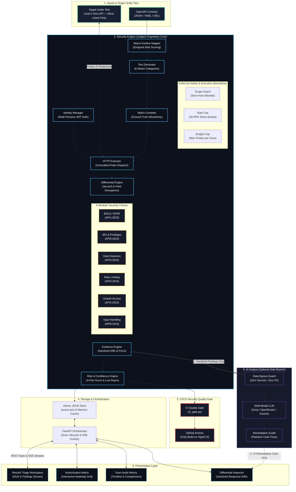
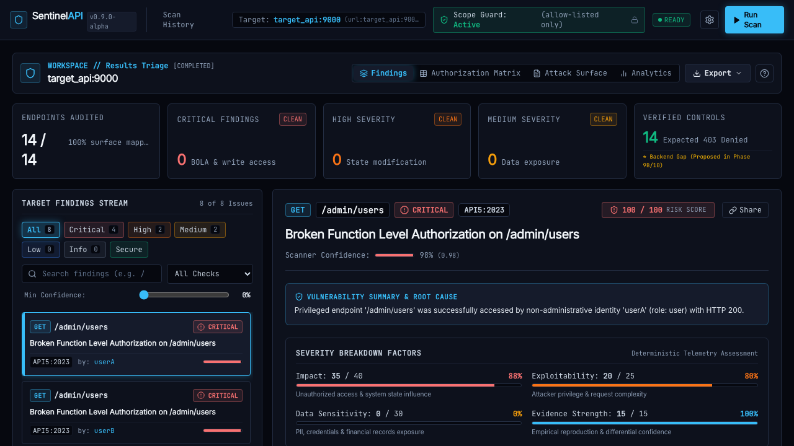
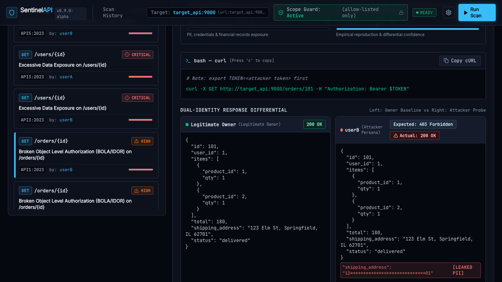
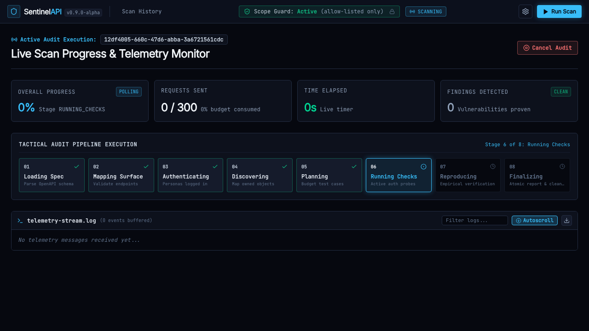
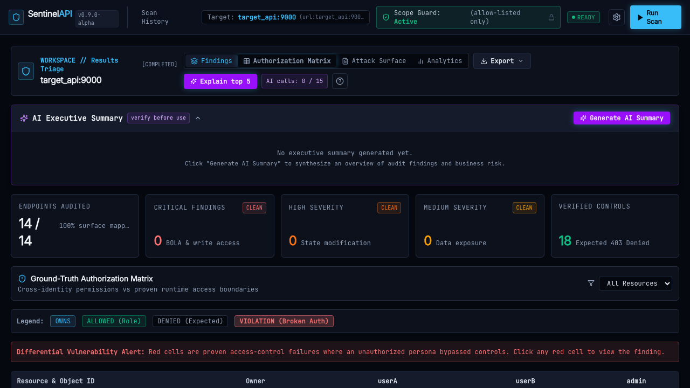
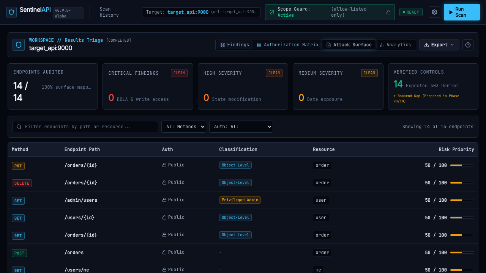
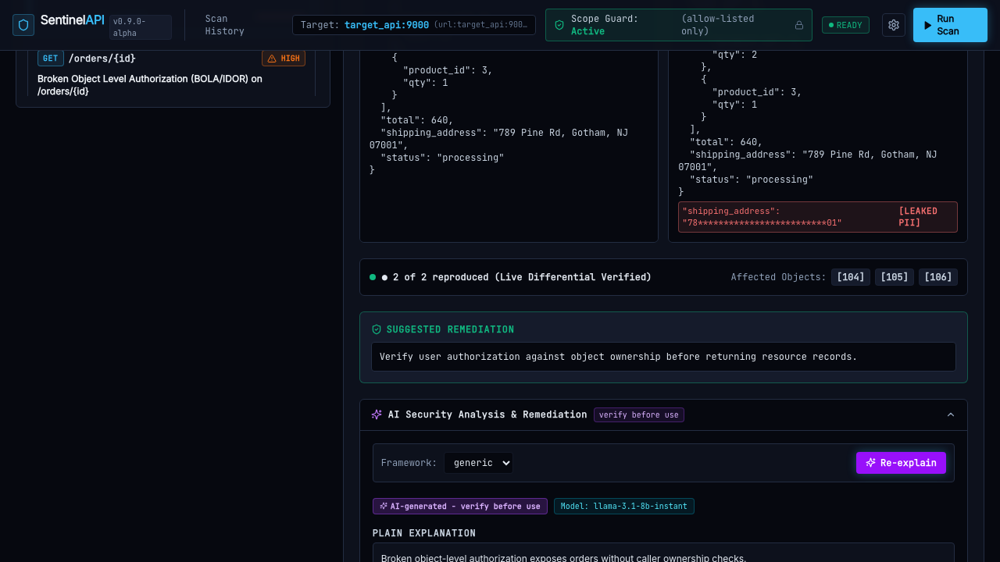

# SentinelAPI: Autonomous Differential API Security Testing

**SentinelAPI** is an autonomous API security scanner engineered specifically for authorization, object-level access control, and data-exposure vulnerabilities across modern REST APIs. By ingesting OpenAPI 3.x specifications, dynamically authenticating multiple test personas, learning ground-truth resource ownership without brute-forcing, and executing differential response analysis, SentinelAPI uncovers critical OWASP API Top 10 vulnerabilities (such as BOLA/IDOR, BFLA, and broken tenant boundaries) with mathematical precision, empirical live reproduction, and zero secrets exposure.

---

## ⚠️ Ethics & Authorized Use Statement

> [!CAUTION]
> **STRICT AUTHORIZED TESTING NOTICE**
> 
> SentinelAPI is designed exclusively for testing **explicitly authorized**, sandboxed, or customer-owned API environments.
> 
> - **Never scan any API without prior, explicit, written authorization from the system owner.**
> - The scanner strictly enforces an immutable scope guard (`assert_in_scope`) against an explicit allowlist (`ALLOWED_HOSTS`). Outbound HTTP probe dispatches to unauthorized external domains, public IPs, or look-alike URLs are terminated immediately with a `ScopeViolationError`.
> - The included target sandboxes (`target_api`, `health_api`, `fintech_api`) contain intentional, realistic authorization flaws built strictly for evaluation and demonstration on `127.0.0.1`. Never expose them to public networks.
> - Unauthorized penetration testing or vulnerability scanning of third-party networks may violate local and international cybercrime legislation, including the Computer Fraud and Abuse Act (CFAA) and GDPR.

---

## CI / CD Build & Verification Status

[](https://github.com/x03tanuj/sentinel-api/actions/workflows/ci.yml)
[](https://github.com/x03tanuj/sentinel-api/actions/workflows/e2e-ui.yml)


---

## Architecture Diagram

SentinelAPI's architecture separates the deterministic security engine (our core proprietary IP) from presentation, storage, and the optional evidence-only AI analysis boundary. 

> [!TIP]
> **Hackathon Pitch Deck Deliverables**: The official AmiHacks Track C presentation deck is available in both PowerPoint ([slides/SentinelAPI_Pitch.pptx](slides/SentinelAPI_Pitch.pptx)) and PDF ([slides/SentinelAPI_Pitch.pdf](slides/SentinelAPI_Pitch.pdf)) formats. High-resolution architecture assets are at [docs/architecture.png](docs/architecture.png) and [docs/architecture_flowchart.pdf](docs/architecture_flowchart.pdf).



### Component Architecture & Safety Boundaries

| Layer / Block | Component | Codebase Module | Purpose & Core Safety Invariant |
| :--- | :--- | :--- | :--- |
| **Inputs** | OpenAPI Contract | `backend/app/parser/loader.py` | Validates OpenAPI 3.x specs, dereferences schemas, handles circular `$ref` safely. |
| **Target Under Test** | Sandboxed Target | `target_api/`, `sample_targets/` | User's own API. Strictly bounded by scope guards (`ALLOWED_HOSTS`). |
| **Security Engine** | Scope Guard | `backend/app/config.py` | Rejects targets outside explicit allowlist; prevents scanning external third parties. |
| **Security Engine** | Rate & Budget Caps | `backend/app/engine/executor.py` | 20 RPS token bucket; capped request budgets per scan prevent denial-of-service. |
| **Security Engine** | Surface Mapper | `backend/app/parser/surface.py` | Extracts parameters, auth rules, operations, and assigns preliminary risk rankings. |
| **Security Engine** | Identity Manager | `backend/app/engine/identity.py` | Multi-persona session & JWT management; credentials never hit disk or telemetry. |
| **Security Engine** | HTTP Executor | `backend/app/engine/executor.py` | Controlled probe dispatch with streaming size limits and automatic token scrubbing. |
| **Security Engine** | Test Generator | `backend/app/engine/generator.py` | Generates prioritized test cases across 6 discrete attack categories. |
| **Security Engine** | Matrix Compiler | `backend/app/engine/matrix.py` | Discovers resource ownership and compiles ground-truth allow/deny expectation matrix. |
| **Security Engine** | Differential Engine | `backend/app/engine/differential.py` | Compares attack vs baseline using weighted Jaccard similarity and schema divergence. |
| **Security Engine** | 6 Security Checks | `backend/app/engine/checks/` | Modular suites for BOLA (API1), Unauth (API2), Data Exposure (API3), Rate Limit (API4), BFLA (API5), Input Handling (API8). |
| **Security Engine** | Evidence Engine | `backend/app/engine/evidence.py` | Defense-in-depth token scrubbing, diff construction, and reproducible curl PoCs (`$TOKEN`). |
| **Security Engine** | Risk & Confidence | `backend/app/engine/risk.py`, `reproduce.py` | Transparent 4-part risk scoring + active empirical reproduction of top findings. |
| **CI/CD Quality Gate** | CI Gate | `scripts/ci_gate.py`, `.github/` | Headless security quality gate breaking GitHub Actions CI builds on High/Critical flaws. |
| **Storage & API** | Snapshot Store | `backend/app/store.py` | In-memory ring buffer with atomic, secret-free JSON disk persistence (`scans.json`). |
| **Storage & API** | FastAPI Orchestrator| `backend/app/routes/scans.py` | REST API routes, bounded cancellation, shielded object cleanup, real-time SSE stream. |
| **Presentation** | React Dashboard | `frontend/src/` | Tactical web UI: Triage Workspace, Authorization Heatmap, Findings Inspector, History. |
| **AI Analyst** | AI Analyst (Optional)| `backend/app/ai/` | **Evidence-only side branch**. Zero secrets/PII; strictly one-way data egress; never feeds detection. |

---

## Quickstart

### 1. Launch Full Stack with Docker Compose
Spin up the scanner engine, web dashboard, and sandboxed test environments in seconds:
```bash
git clone https://github.com/x03tanuj/sentinel-api.git
cd sentinel-api
cp .env.example .env
docker compose up -d --build
```

### 2. Access the Interactive Tactical Dashboard
Open your browser to:
👉 **[http://localhost:8080](http://localhost:8080)** (or [http://localhost:8080/scans/new](http://localhost:8080/scans/new))

### 3. Run the Automated End-to-End Demo Script
Execute our turnkey, idempotent demonstration script to spin up the services, execute a live vulnerable scan, verify the zero-trust secure baseline, and restore the UI:
```bash
bash scripts/demo.sh
```

---

## Vulnerability Detection Scope

### What SentinelAPI Detects
- **BOLA / IDOR (Broken Object Level Authorization - OWASP API1:2023)**:
  - Unauthorized object-level resource reading (`GET /orders/{id}`) across distinct customer accounts.
  - State-modifying cross-tenant tampering (`PUT/PATCH /orders/{id}`) and object deletion (`DELETE /orders/{id}`) executed strictly against scanner-created test records.
- **BFLA (Broken Function Level Authorization - OWASP API5:2023)**:
  - Administrative endpoint accessibility by unprivileged regular user roles (`GET /admin/users`, `/admin/metrics`).
  - Vertical privilege escalation across hierarchical roles.
- **Excessive Data Exposure & Sensitive Data Leakage (OWASP API3:2023)**:
  - Leaked undeclared payload fields outside the documented OpenAPI schema (`ssn`, `password_hash`, credit cards, internal server metadata).
- **Missing Authentication & Anonymous Access (OWASP API2:2023)**:
  - Endpoints marked as requiring authentication in OpenAPI that return valid business data to anonymous callers (`GET /reports/summary`).
- **Unrestricted Resource Consumption & Rate Limiting (OWASP API4:2023)**:
  - Authentication and brute-force endpoints lacking burst protection and rate limiting (`POST /auth/login`).
- **Improper Input Handling Anomalies (OWASP API8:2023)**:
  - Boundary type mutations, adjacent numeric IDs, and malformed inputs returning unhandled `500 Internal Server Error` exceptions.

### What SentinelAPI Explicitly Does NOT Detect
To maintain engineering honesty and eliminate false promises:
- **Injection Attacks (SQLi, NoSQLi, Command Injection, XSS)**: SentinelAPI does not inject database syntax or JavaScript payloads.
- **Network / Transport Vulnerabilities**: Does not scan TLS ciphers, DNS configuration, or port forwarding.
- **State-Modifying BFLA on Untracked Objects**: Does not blind-fire `DELETE /admin/purge` to avoid destructive side-effects.
- **SSRF / XML External Entities (XXE)**: Does not attempt remote server ping-backs or XML entity expansions.
- **Non-OpenAPI Legacy APIs**: Requires a valid OpenAPI / Swagger 3.x schema to map endpoint contracts.

---

## Our Technologies: The Core Engines

SentinelAPI is built from the ground up without off-the-shelf DAST scanners. The architecture is driven by specialized core engines:

1. **OpenAPI Spec Loader & Resolving Parser**: Validates OpenAPI 3.x contracts, handles schema dereferencing, and detects circular `$ref` schemas with fallback isolation.
2. **Attack Surface & Risk Prioritization Engine**: Analyzes endpoint paths, HTTP methods, and parameter schemas to compute risk rankings (favoring state-changing writes and privileged routes).
3. **Multi-Persona Identity Orchestration Engine**: Authenticates multiple simultaneous user roles (`userA`, `userB`, `admin`) via JWT or session tokens without storing cleartext credentials.
4. **Autonomous Ownership Discovery Engine**: Discovers which resources each user legitimately owns by querying standard profile and collection endpoints without brute-forcing IDs.
5. **Ground-Truth Authorization Matrix Compiler**: Constructs a mathematical grid mapping every known resource object against every identity with `ALLOW` or `DENY` expectations.
6. **Guarded HTTP Execution Engine**: Dispatches rate-limited requests through a token-bucket rate limiter, strict scope validation, response truncation, and redaction filters.
7. **Differential Response Analysis Engine**: Computes weighted Jaccard similarity distance, status-code divergence, and sensitive-field exposure between baseline and attack responses.
8. **Explainable Risk & Severity Engine**: Replaces arbitrary CVSS guesswork with a transparent 4-component calculation: **Impact** (0-40) + **Exploitability** (0-25) + **Data Sensitivity** (0-30) + **Evidence Strength** (0-15).
9. **Empirical Reproduction Engine**: Actively re-executes top-scoring attack probes against the live API to empirically prove reproducibility, boosting confidence to `1.00` or downgrading severity if unrepeatable.
10. **Evidence-Only AI Analyst Boundary**: Passes sanitized, secret-free finding fingerprints to LLMs for natural-language explanations, code fixes, and executive summaries with strict zero-leak egress guards.

---

## Visual Tour & Screenshots

SentinelAPI provides a tactical developer interface built for rapid triage and verification.

| Results Triage Workspace | Differential Finding Inspector |
| :---: | :---: |
|  |  |

| Live Scan Telemetry Stepper | Ground-Truth Authorization Matrix |
| :---: | :---: |
|  |  |

| Discovered Attack Surface | AI Remediation & Code Fix |
| :---: | :---: |
|  |  |

---

## CI / CD Security Quality Gate (`scripts/ci_gate.py`)

SentinelAPI functions as a native CI quality gate for customer deployment pipelines. It evaluates exported scan JSON against configurable severity and confidence policies:

```bash
# Run scanner via CLI and export JSON findings
python -m app.cli scan \
  --spec http://target_api:9000/openapi.json \
  --base-url http://target_api:9000 \
  --identity userA,user,userA,passA123 \
  --identity userB,user,userB,passB123 \
  --identity admin,admin,admin,admin123 \
  --budget 100 \
  --json-out findings.json

# Enforce quality gate (fails with exit code 1 on CRITICAL/HIGH findings with confidence >= 0.7)
python scripts/ci_gate.py --findings findings.json --fail-on CRITICAL,HIGH --min-confidence 0.7
```

### GitHub Actions Integration Example
```yaml
- name: Run SentinelAPI Security Gate
  run: |
    docker compose exec -T scanner python -m app.cli scan --spec http://api:8000/openapi.json --base-url http://api:8000 --json-out findings.json
    python scripts/ci_gate.py --findings findings.json --fail-on CRITICAL,HIGH --min-confidence 0.7
```

---

## AI Analyst Data-Handling & Egress Safety Statement

SentinelAPI treats data privacy and security with defense-in-depth guarantees:

1. **Zero Raw Data Egress**: The AI layer **never** sees URLs, hostnames, IP addresses, credentials, passwords, Bearer tokens, or raw response bodies.
2. **Pre-Flight Safety Assertion**: Every payload dispatched to an LLM provider is scanned by `assert_payload_safe()`. If any token, SSN, credit card, or email pattern is detected, egress is blocked immediately.
3. **Deterministic Fallback**: If an LLM provider fails, returns invalid JSON, times out, or reaches call limits, SentinelAPI seamlessly falls back to pre-compiled deterministic remediation templates.
4. **Immutability Principle**: The AI model **cannot modify** finding severity or confidence scores. Findings are strictly defined by empirical security engine diffs.

---

## Known Limitations

- **Non-GET Privileged Endpoints**: To prevent destructive side-effects, the scanner does not execute state-modifying write operations (`DELETE /admin/purge`) against pre-existing administrative endpoints.
- **Rate-Limit Detection Window**: Rate limiting detection is bounded by `MAX_RPS` (default 20 requests/sec). APIs requiring bursts greater than 50 requests to trip rate limits may be noted as inconclusive.
- **OpenAPI 3.x Only**: Specifications written in Swagger 2.0 must be converted to OpenAPI 3.0+ before scanning.
- **Not an Injection Scanner**: Does not test for SQL injection, command execution, or cross-site scripting.

---

## Roadmap

- **SaaS Multi-Tenant Cloud**: Cloud-hosted distributed scanner workers with centralized team permissions.
- **OAuth2 / OIDC Flow Automation**: Automated PKCE authorization code grant negotiation for enterprise SSO.
- **Custom Policy Rules Engine**: Declarative YAML policy rules for custom compliance frameworks (HIPAA, PCI-DSS, SOC2).
- **Persistent Database Storage**: MongoDB / PostgreSQL persistence adapters for multi-year enterprise audit archiving.

---

## Local Development & Contribution

### Backend Setup
```bash
python3 -m venv .venv
source .venv/bin/activate
pip install -r target_api/requirements.txt
pip install -r backend/requirements.txt

# Run backend test suite
cd backend
pytest -v -m "not e2e and not integration and not live_llm"

# Run hermetic E2E tests
pytest -q -m e2e
```

### Frontend Setup
```bash
cd frontend
npm ci

# Run type check, linting, and unit tests
npm run typecheck
npm run lint
npm test

# Run Playwright E2E tests (requires running backend/mock)
npm run e2e
```
